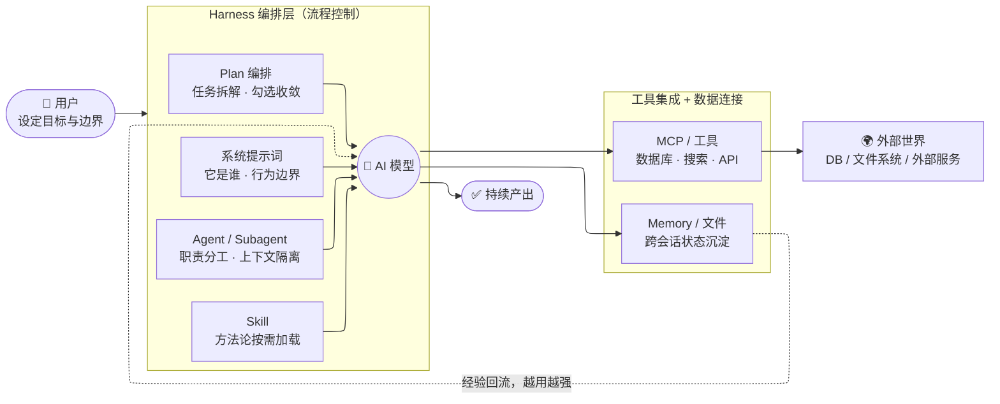

# Harness Engineering 一张图

**读图要点：**

- **模型是租来的，harness 是自己的资产** —— 同一个模型，套什么 harness 决定它是聊天机器人还是工程系统
- **左侧（流程控制）**：提示词定义「它是谁」，Agent/Skill/Plan 定义「按什么分工和流程干活」
- **右侧（工具 + 数据）**：MCP 给模型「手」去读写世界，Memory 让经验沉淀并回流，系统越用越强
- **用户的角色**：不再推动每一步，只设定目标与边界

**我们的具体落地：**

| 组件 | 实例 |
|---|---|
| MCP | **MySQL MCP** —— 模型主动连接数据库查询/验证数据；**Redis MCP** —— 直连缓存中间件；**Playwright MCP** —— 让 agent 控制浏览器执行端到端测试 |
| Skill | **代码规范 skill** —— 把团队编码规范打包，生成代码时按需加载；**yo-vitest skill** —— 前端测试指南 |
| Agent | **按应用技术栈配不同 agent** —— 前端 agent、后端 Java agent、后端 Python agent，各自带对应的技术底座与规范，构建不同应用时选用 |
