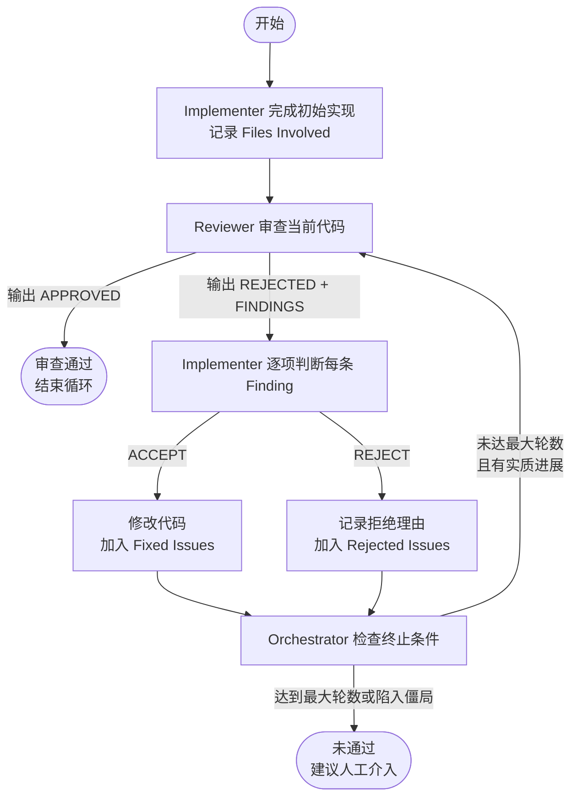

# 实现/检查模式：迭代审查循环

## 核心思想

把“写代码”和“审代码”拆成两个独立角色，由 Orchestrator 驱动它们反复协作，直到实现通过审查或触发终止条件。本质上是让实现者（Implementer）和审查者（Reviewer）在每一轮中只关注各自的职责，通过状态机避免重复争论和无限循环。

## 角色分工

| 角色 | 职责 | 能力 |
|---|---|---|
| **Orchestrator（主控）** | 维护 Review State、调度 Agent、判断终止条件 | 不直接写代码，只传递上下文 |
| **Implementer（实现者）** | 根据需求和审查意见写代码 | 对每条 Finding 输出 `ACCEPT` 或 `REJECT`，仅修改被接受的项 |
| **Reviewer（审查者）** | 检查实现是否符合需求 | 读取文件，输出结构化缺陷列表或 `APPROVED` |

## 循环流程

## 状态管理

每轮之间通过统一的 Review State 传递信息：

- `Round`：当前轮次
- `Files Involved`：被修改/创建的文件
- `Fixed Issues`：已接受并修复的问题
- `Rejected Issues`：已拒绝的问题及拒绝理由
- `Last Action`：上一轮动作

## 终止条件

1. **审查通过**：Reviewer 输出 `STATUS: APPROVED`。
2. **达到最大轮数**：默认 20 轮，未通过则报告未解决问题并建议人工介入。
3. **陷入僵局**：连续两轮发现的问题数相同，无实质进展，提示人工裁决。

## 关键规则

- **需求冻结**：任何一轮都不得修改原始需求。
- **禁止重复争论**：已进入 `Rejected Issues` 的问题，除非发现新的技术角度，否则不得重提。
- **状态持久**：Agent 之间只通过 Review State 交换信息。
- **中立主控**：Orchestrator 不发表技术判断，只控制流程。

## 与结构化编排流程的对比

| 维度 | 迭代审查循环 | 结构化编排流程 |
|---|---|---|
| 关注点 | 代码质量、缺陷收敛 | 需求拆解、任务计划 |
| 驱动方式 | 双 Agent 对抗式审查 | MCP 工具 + 设计/计划文档 |
| 适用场景 | 对代码质量要求高的实现任务 | 复杂功能的设计与分阶段实施 |
