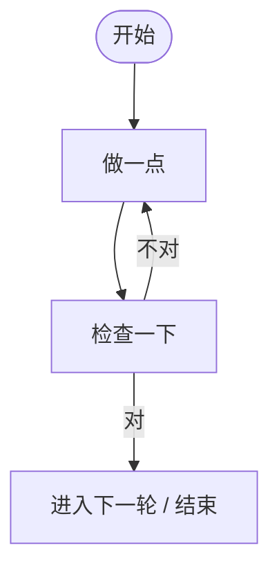
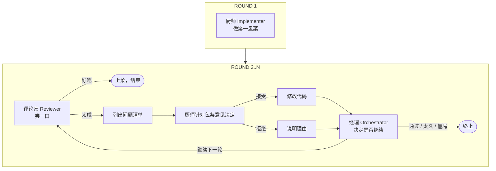
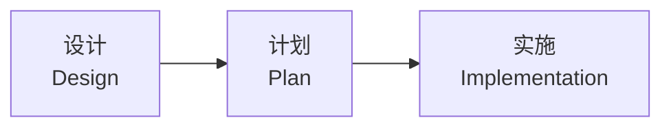

# Loop Engineering：把复杂的事情放进一个“圈”里

> 一种让大工程不再“写着写着就偏了”的工程思维方式。

---

## 一、先讲一个故事

假设你让一个朋友去厨房做一道红烧肉。你们隔着一堵墙，只能通过纸条交流。

**方式一：一次性交付**

你把菜谱塞给他，说：“按这个做，做好了叫我。”

半小时后，你打开厨房门，发现锅里是一坨黑炭。这时候你只能把整锅倒掉，从头再来。最可怕的是，你甚至不知道他哪一步错了：是火太大？糖色炒糊了？还是压根没放盐？

**方式二：Loop Engineering**

你说：

> “切完肉给我看一眼。”
> “炒糖色时给我闻一下。”
> “加水烧开后叫我。”
> “出锅前尝一口咸淡。”

每一步都有明确的检查点，出了问题立刻调整。虽然你多跑了几趟厨房，但**大概率不会做出黑炭**。

Loop Engineering 就是这个道理：**把一件复杂的事拆成很多小圈，每跑一圈就停下来检查、修正、再跑下一圈。**

---

## 二、Loop Engineering 不是什么高深学问

你可以把它理解成三种常见思想的结合：

| 你熟悉的说法 | 在 Loop Engineering 里的意思 |
|---|---|
| “小步快跑” | 不要一次性做完，分成很多轮 |
| “边做边检查” | 每一轮都有明确的验收标准 |
| “有人做、有人看” | 执行和审查角色分开，避免自己骗自己 |

它不是一种新的编程语言，也不是某个具体工具，而是一种**组织工作的方式**。

---

## 三、为什么软件特别需要 Loop Engineering？

因为软件写出来太容易“悄悄变形”了。

想象一下你让 AI 写一个电商网站：

- 一开始你说“做个购物车”。
- 它做完后你觉得“再加个优惠券”。
- 加完优惠券，发现购物车里的价格计算错了。
- 修完价格，又发现优惠券和会员系统冲突。
- 修完冲突，原来的下单流程又不通了。

这就是典型的“一次性交付陷阱”：**你讲得越复杂，结果偏离得越远。等发现时，已经不知道从哪里开始改了。**

Loop Engineering 的做法是：在每加一个功能之前，先确认上一圈的东西是对的。就像盖楼时，每砌一层都要验收，而不是等整栋楼盖完了才发现地基歪了。

---

## 四、一个 Loop 里有什么？

一个最小可用的循环长这样：

看起来很简单，但要让这个圈真正有效，必须回答三个问题：

### 1. 谁来做？（角色分离）

不能让同一个人既做菜又当评委。Loop Engineering 要求至少有两种角色：

- **做事的人**：专心实现，不纠结对不对。
- **检查的人**：对照标准，找出问题。
- **主持的人（可选）**：决定要不要继续、什么时候停。

在我们的项目里，这三个角色叫 **Implementer（实现者）**、**Reviewer（审查者）**、**Orchestrator（主控）**。

### 2. 怎么知道对了？（终止条件）

循环不能无限转下去，必须有明确的“到站信号”：

- 审查者说“通过了”→ 停。
- 跑了太多轮还没结果→ 停，喊人来看。
- 连续两轮都没进展→ 停，说明陷入僵局。

没有终止条件的循环，就像洗衣机忘了关，衣服会越洗越皱。

### 3. 状态存在哪？（可观测）

每一轮结束后，必须把结果记下来，而不是让下一个人去猜。常见的状态包括：

- 当前是第几轮
- 改了哪些文件
- 哪些问题已经修好了
- 哪些问题被拒绝了、理由是什么
- 上一轮做了什么

这就像我们去医院看病，医生不会每次见面都问“你之前吃了什么药”，而是直接看病历。Loop Engineering 要求工程也有“病历”。

---

## 五、我们项目里的两种 Loop

### Loop 1：迭代审查循环——“厨师与美食评论家”

这个循环专门解决一个问题：**代码写对了吗？**

流程像下面这样：

它的特点是：**高频、小步、对抗性**。通过让“做的人”和“挑刺的人”反复过招，让代码质量快速收敛。

详细规则见 [`iterative-review-approach.md`](iterative-review-approach.md)。

---

### Loop 2：结构化编排流程——“建筑师、工长、施工队”

这个循环解决另一个问题：**一个大功能怎么落地？**

它不是直接写代码，而是先把工程分成三个不可逆的阶段：

就像盖房子：

- **设计阶段**：建筑师画蓝图，回答“要盖什么样的房子”。
- **计划阶段**：工长把蓝图拆成任务，回答“先打地基还是先砌墙”。
- **实施阶段**：施工队开工，完成一个个小任务。

每个阶段结束都会产出“契约文档”：

- `design.md`：需求契约，所有人对“做什么”达成一致。
- `plan.md`：进度契约， checkbox 打勾才算完成。

这个流程不是简单的“做完一步做下一步”，而是**每个阶段内部也可以继续细分小循环**。大模块拆成小功能，每个小功能都可以看作一次小循环：开工 → 完成 → 打勾 → 下一个。

详细规则见 [`orchestration-methodology.md`](orchestration-methodology.md)。

---

## 六、两个 Loop 怎么配合？

想象你要开一家餐厅：

- **结构化编排流程**负责“把餐厅开起来”：选址、装修、招聘、菜单设计、开业准备。每件事都拆成任务，逐个完成。
- **迭代审查循环**负责“保证每道菜好吃”：厨师做一道，评论家尝一道，不满意就改，直到这道菜能上桌。

所以它们的关系是：

> **先用大 Loop 把复杂工程拆成模块，再用小 Loop 保证每个模块的质量。**

|  | 迭代审查循环 | 结构化编排流程 |
|---|---|---|
| 像什么 | 品控环节 | 项目管理 |
| 问的问题 | 这块代码对吗？ | 这个功能怎么落地？ |
| 结束标志 | 审查通过 | 所有任务打勾 |

---

## 七、Loop Engineering 的生活版本

其实你每天都在用 Loop Engineering，只是没意识到：

- **健身**：不是一次性练出腹肌，而是每周练、每周称体重、根据结果调整计划。
- **减肥**：不是饿一天看效果，而是每天记录饮食，每周复盘。
- **写论文**：不是直接写终稿，而是先写大纲、给老师看、改、再看、再改。
- **谈恋爱**：不是表白一次就完事，而是聊天 → 试探 → 调整 → 再聊天……（这个循环有时候也会无限跑下去，说明终止条件很难设计。）

所有需要“逐步逼近目标”的事情，本质都是 Loop。

---

## 八、Loop Engineering 的“八字诀”

如果把这种思维方式浓缩成八句话：

1. **大事化小**：复杂任务拆成可循环的小块。
2. **小步快跑**：每一圈只做一点点，但要及时检查。
3. **角色分开**：做的人和看的人不能是同一人。
4. **状态落地**：把循环状态写出来，不要留在脑子里。
5. **标准明确**：每圈结束要知道“什么算对”。
6. **及时止损**：跑太久或没进展，要果断停下来叫人。
7. **不可逆阶段**：设计、计划、实施不要混着来。
8. **工具约束**：让流程通过工具调用顺序强制执行。

---

## 九、一句话总结

> **Loop Engineering 就是：别想着一次把事情做对，而是设计一个能自动纠偏的循环，让它带着你一步一步走到对的地方。**

它不会让你写得更快，但会让你**少返工、少踩坑、少在凌晨三点怀疑人生**。

---

## 十、延伸阅读

- 想看“怎么让代码越审越好”，读 [`iterative-review-approach.md`](iterative-review-approach.md)。
- 想看“怎么把大需求拆成能落地的任务”，读 [`orchestration-methodology.md`](orchestration-methodology.md)。
