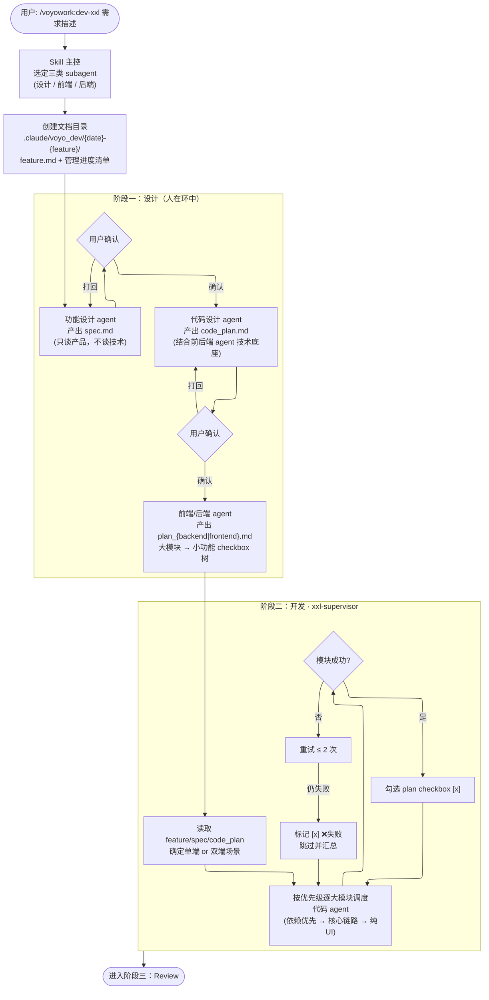
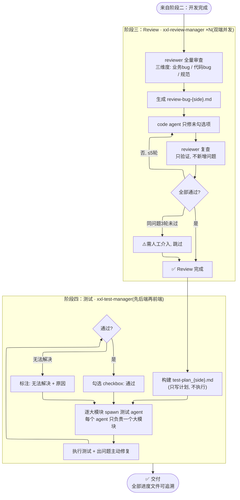
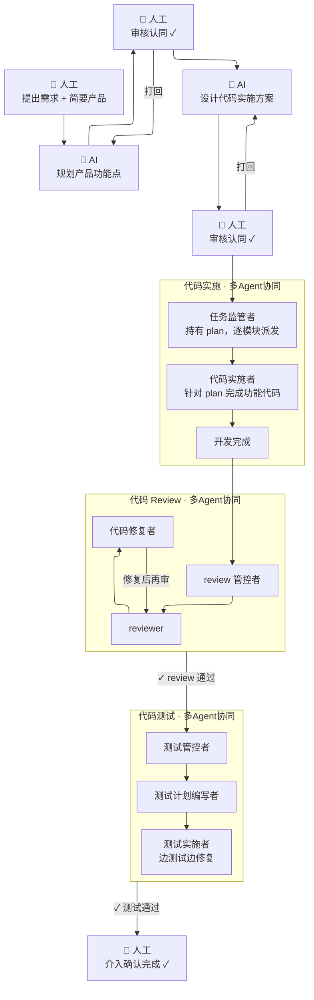

# yo-dev-xxl：大型功能开发的工程化哲学

> 从「写代码」到「治理代码」—— 一个多 Agent 协作开发流程的设计解读

## 一、它解决什么问题

大型功能开发的失败，很少是「写不出来」，更多是「写着写着失控了」：

- 需求在上下文中漂移，写着写着就偏离了原始意图；
- 单个 Agent 的上下文越滚越长，前端、后端、review、测试互相污染；
- 进度只存在于 Agent 的「记忆」里，会话一断就无人知晓现状；
- review 和测试被压缩成开发末尾的一次性仪式，发现问题时返工成本极高。

`yo-dev-xxl` 的回答是：**把一次大功能开发，治理成一条由文档驱动、由专职管理 Agent 调度、由人在关键节点把关的流水线。**

入口只有一句话：

```bash
/voyowork:dev-xxl <需求描述>
```

但背后是一套三层角色、六份契约文档、三个管理 Agent 的完整工程流程。

## 二、全流程总览

### 图一：设计与开发（阶段一、二）



### 图二：Review 与测试（阶段三、四）



### 图三：人 + AI Agent 协同全景

> 视角参考《人Agent协同.png》：人工把控关键节点，AI 多 Agent 协同落地。
> 与参考图不同的是，「拆解编码任务」在我们流程中不是一步动作，而是一个由**任务监管者**驱动、**代码实施者**逐模块收敛 plan 的完整循环。



## 三、角色体系：三层分离

流程严格区分三层角色，**每一层都不知道、也不需要知道其他层的细节**：

| 层级 | 角色 | 职责 | 是否写代码 | 生命周期 |
|---|---|---|---|---|
| 主控层 | skill 主会话 | 流程编排、与用户确认、更新 feature.md 管理进度 | ❌ | 贯穿全程 |
| 管理层 | xxl-supervisor / xxl-review-manager / xxl-test-manager | 各自阶段内的调度与进度跟踪 | ❌ | 单个阶段 |
| 执行层 | 设计 / 前端 / 后端 / reviewer / 测试 agent | 完成被派发的具体任务 | ✅ | 单个大模块甚至单个任务 |

两个关键约束：

1. **管理层不写代码。** 三个 manager 的 prompt 里都有同一条铁律：「不亲自写代码，只调度和跟踪」。它们唯一允许修改的文件是自己的进度文件（plan / review-bug / test-plan）。
2. **执行层没有全局视角。** 每个 subagent 只被注入它需要的那部分文档片段，完成任务、返回结果、即被销毁。上下文污染被结构性地避免了。

> 这是「指挥官—工兵」结构在多 Agent 场景下的完整形态：指挥官保持冷静的全局视角，工兵保持专注的执行视角，中间还有一层「监工」保证指挥官不被执行细节淹没。

## 四、文档即契约：六份文件的分工

所有状态都落在 `{project_dir}/.claude/voyo_dev/{yyyy-MM-dd}-{feature_name}/` 目录下的文件中，而不是 Agent 的上下文里：

| 文件 | 性质 | 写入者 | 读者 |
|---|---|---|---|
| `feature.md` | 流程契约 | skill 主控 | 所有管理 agent（定位自己的进度位置） |
| `spec.md` | 需求契约 | 功能设计 agent | 后续所有 agent |
| `code_plan.md` | 技术契约 | 代码设计 agent | supervisor、test-manager 及其 subagent |
| `plan_{backend\|frontend}.md` | 任务契约 | 前端/后端 agent | supervisor（勾选）、reviewer、测试 agent |
| `review-bug-{side}.md` | 质量契约 | review-manager | code agent（修复清单）、reviewer（复查依据） |
| `test-plan_{side}.md` | 验收契约 | 测试计划 agent | test-manager（勾选）、测试 agent |

把状态写进文件的深层收益：

1. **持久性**：会话中断、上下文压缩、Agent 重启，都不丢进度 —— 续跑时从未勾选项直接继续。
2. **可审计**：任何人随时能回答「原计划是什么、完成了什么、哪些失败了、为什么」。
3. **去中心化**：subagent 不需要全局历史，读文档即可开工。文档是跨会话、跨 Agent 的共享记忆。

Checkbox 即事实：进度的唯一权威来源是文件里的 `[ ]` / `[x]`，而不是任何 Agent 的口头汇报。管理 agent「亲自更新 checkbox」这条规则在每个 manager 的 prompt 里都被反复强调 —— 因为汇报可以是假的，勾选必须是亲自验证过的。

## 五、设计阶段的哲学：分层思考 + 人在环中

设计被强制拆成三个不可逆的相位，每个相位只允许思考一个层次的问题：

1. **spec.md（产品层）**：只回答「做什么」。设计 agent 被明确禁止谈技术框架与实现方案 —— 因为它不了解技术底座，谈了就是空中楼阁。
2. **code_plan.md（技术层）**：只回答「怎么实现」。由读过前后端 agent 系统提示的代码设计 agent 完成，确保技术方案落在真实的技术底座上。
3. **plan_{side}.md（任务层）**：只回答「怎么拆」。大模块 → 小功能的 checkbox 树，是后续一切调度的依据。

前两个相位都必须**用户确认后才放行**。这是全流程仅有的两个人工关卡，位置经过精心选择：需求错了，后面全错；技术方案错了，实现必然返工。而任务拆分之后的阶段，人就可以放手了 —— 因为约束已经足够强。

## 六、质量内建：Review 与 Test 不是尾声，是独立工序

传统流程里 review 和测试是开发末尾的「仪式」，yo-dev-xxl 把它们提升为**独立调度、独立收敛**的两个阶段：

### Review（xxl-review-manager）

- **三维度审查**：业务 bug（逻辑是否符合需求）、代码 bug（运行时错误）、规范符合性 —— 分别对应「对不对、稳不稳、美不美」。
- **修复-复查循环**：code agent 只修未勾选项（不做额外改动），reviewer 只复查不新增问题（防止范围蔓延）。
- **收敛保障**：同一问题 3 轮未过 → 标注「⚠️需人工介入」；总轮次上限 5 轮。**循环必须有出口**，这是工程化与「无限拉扯」的分界线。
- **双端并发**：前后端各起一个 review-manager，互不阻塞。

### Test（xxl-test-manager）

- **计划先行**：先构建 test-plan 文件，再执行测试 —— 测试范围是设计出来的，不是随手点出来的。
- **单模块单 agent**：每个测试 subagent 只负责一个大模块，测完即销毁。
- **测试即修复**：测试 agent 发现问题时当场修复，直到负责的大模块通过或承认无法解决 —— 测试不是「挑错」，而是「交付前最后一次开发」。
- **环境红线**：后端测试禁止本地搭数据库/中间件，连不上就退出，绝不伪造环境。测试的真实性高于测试的完成率。
- **顺序约束**：双端时强制先后端再前端 —— 接口是前端测试的地基。

## 七、异常处理的哲学：失败是流程的一部分

流程不假设一切顺利，而是把失败设计成可追踪、可跳过的正常分支：

| 场景 | 机制 |
|---|---|
| 开发模块失败 | 重试 ≤ 2 次 → 标记 `❌失败`，跳过继续，末尾汇总 |
| Review 问题反复修不好 | 3 轮未过 → `⚠️需人工介入`，不阻塞其他项 |
| Review 循环不收敛 | 5 轮上限强制结束，汇总遗留 |
| 测试用例无法解决 | checkbox 标注「无法解决 + 原因」，继续后续用例 |
| 测试环境不可用 | 直接退出，不伪造结果 |
| 管理 agent 中途关闭 | skill 主控检查返回值，未完成则重启它继续 |

共同的原则：**局部失败不扩散，但绝不静默。** 每个失败都被如实记录在文件里，最终汇总呈现给用户 —— 流程可以绕过失败，但不能掩盖失败。

## 八、一句话总结

> yo-dev-xxl 把一个大型功能的开发，从「一个 Agent 的一次性长篇即兴发挥」，治理成「文档契约驱动、三层角色分工、关键节点人工把关、每个循环有收敛出口」的结构化流水线。
>
> Agent 负责执行，文档负责记忆，人负责判断 —— 三者各司其职，代码是这条流水线的自然产出。
