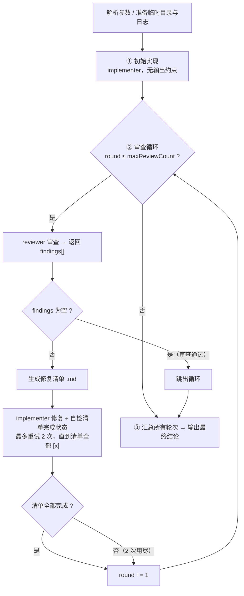

# iterative-runner

一个"实现—审查—修复"的迭代式代码生成运行器。它通过反复调用 Claude Code 的无头子进程（`claude -p`），让**实现者（implementer）**写代码、**审查者（reviewer）**挑问题，循环直到审查通过或达到上限，最后给出总结。

入口文件：[`iterative.ts`](./iterative.ts)

---

## 一、整体流程

`iterative.ts` 的 `main()` 串起整个生命周期，分为四个阶段：



核心状态由 `State` 接口承载：

| 字段 | 含义 |
| --- | --- |
| `round` | 当前审查轮次，从 1 开始 |
| `projectDir` | 项目根目录（即 `cwd`） |
| `tmpDir` | 本次运行的临时目录，存放各轮修复清单 |
| `requirements` | 用户的需求描述 |
| `agentName` | 实现者 agent 名，默认 `implementer` |
| `maxReviewCount` | 审查轮数上限，默认 `5` |

---

## 二、命令行用法

```bash
node --experimental-strip-types iterative-runner/iterative.ts \
  [--agent <name>] \
  [--max-review-count N] \
  "<需求描述>"
```

参数由 [`lib/utils.ts`](./lib/utils.ts) 的 `parseCliArgs` 解析：

- `--agent <name>`：指定实现者 agent，默认 `implementer`。
- `--max-review-count N`：审查轮数上限，必须为 `>= 1` 的整数，默认 `5`。超出范围会报错退出。
- 其余非 flag 文本合并为 `requirements`（需求描述）。若为空则打印用法并 `exit(1)`。

> 注意：flag 解析用的是正则 `--key value` 形式，需求描述中若含 `--xxx yyy` 段落会被当作 flag 吞掉。

---

## 三、各阶段详解

### 阶段 ① 初始实现

调用 `runImplementAgent(state, true)`，用 `runClaudeTextAgent`（文本输出，不约束格式）让 implementer agent 直接按需求写代码。Prompt 形如：

```
#这是用户的需要：
<requirements>

请根据以上需求实现代码。
完成后直接结束即可，无需返回特定格式。
```

完成后记录一条 `implement_initial` 日志。

### 阶段 ② 审查循环

`while (state.round <= state.maxReviewCount)`，每轮做三件事：

**1) 审查 — `runReviewAgent`**

固定调用 `reviewer` agent，并通过 `--json-schema`（[`schemas/reviewer-schema.json`](./schemas/reviewer-schema.json)）强制其返回结构化 JSON 数组：

```json
[{ "issue": "问题描述", "expected": "期望的修复标准" }]
```

审查 Prompt 要求 reviewer 依次做三件事：功能比对、逻辑 bug 检查、隐患检查（安全/性能/边界）。若无问题返回 `[]`。

- 返回非数组 → 抛错终止流程。
- 返回空数组 → 打印 `review passed`，`break` 跳出循环。

每轮 findings 会记录为 `review_findings` 日志。

**2) 生成修复清单 — `generateIssueFile`**

把 findings 写成 Markdown 清单文件 `<tmpDir>/<round>.md`，每项形如：

```markdown
- [ ] <issue>
  - 期望：<expected>
```

这里会先用 `callModel`（直接调 `/v1/messages`）让模型把 findings 整理成规范 Markdown；若模型输出不含 `- [ ]`，则回退到本地拼接的简单格式。

**3) 修复 + 完成自检（最多 2 次）**

内层 `for (attempt = 1..2)` 循环：

- `runImplementAgent(state, false, issueFile)`：把修复清单文件路径交给 implementer，让它"查看清单 → 修复问题 → 把对应项的 `- [ ]` 改成 `- [x]`"。
- `checkIssueFileCompleted(issueFile)`：判断清单是否全部完成。
  - 先用 `callModel` + `json_schema` 让模型判定，返回 `{"completed": true/false}`；
  - 若 JSON 解析失败，回退为本地字符串判断：清单中不再包含 `- [ ]` 即视为完成。
- 一旦 `fixed === true` 立即 `break`，否则 2 次用尽后打印 `fix attempts exhausted`。

无论是否修复完成，`state.round += 1` 进入下一轮审查。

### 阶段 ③ 最终归纳 — `summarizeAllRounds`

读取 `tmpDir` 下所有 `.md` 文件（按文件名排序，即按轮次），拼接后用 `callModel` 让模型给出最终结论：总轮数、每轮核心问题、修复情况、是否遗留。结果直接打印到 stdout，并记录为 `final_summary` 日志。

若中途没有产生任何 `.md`（即首轮审查即通过），返回"所有轮次均未发现问题，流程结束"。

---

## 四、终止条件

流程在以下任一情况结束：

1. **审查通过**：某轮 reviewer 返回空数组，提前 `break`。
2. **达到上限**：`state.round > maxReviewCount`，打印 `reached max review count`。
3. **出错**：任何阶段抛异常，打印错误并 `exit(1)`，错误信息（含 stack）写入 `error` 日志。

---

## 五、两种模型调用方式

`iterative.ts` 区分了两类调用，对应不同模块：

| 方式 | 模块 | 用途 | 特点 |
| --- | --- | --- | --- |
| `runClaudeTextAgent` / `runClaudeAgent` | [`lib/claude-spawn.ts`](./lib/claude-spawn.ts) | 调用 **agent**（implementer / reviewer）执行真实编码与审查任务 | `spawn` 一个 `claude -p` 子进程，带 `--dangerously-skip-permissions`；`runClaudeAgent` 额外用 `--output-format json` + `--json-schema` 拿结构化输出 |
| `callModel` | [`lib/call-model.ts`](./lib/call-model.ts) | 轻量文本任务：整理修复清单、判定清单完成、最终归纳 | 直接 `fetch` 调用 `/v1/messages`，不经过 Claude Code 子进程 |

`callModel` 依赖三个环境变量（缺失即报错）：

- `ANTHROPIC_BASE_URL`
- `ANTHROPIC_AUTH_TOKEN`
- `ANTHROPIC_MODEL`

---

## 六、文件与日志产出

本次运行的所有产物落在项目根的 `.voyo-work/` 下：

```
.voyo-work/
├── tmp/
│   └── iterative.<6位随机数>/     # tmpDir
│       ├── 1.md                   # 第 1 轮修复清单
│       ├── 2.md                   # 第 2 轮修复清单
│       └── ...
└── logs/
    └── <yyyy-MM-dd>/
        └── iterative_<yyyyMMddHHmmss>.log   # JSONL 日志
```

日志由 [`lib/log-state.ts`](./lib/log-state.ts) 的 `createLogger` 产出，每条记录一行 JSON，含 `timestamp` 字段。记录类型：

- `implement_initial` — 初始实现完成
- `review_findings` — 某轮审查结果（含 findings）
- `implement_fix` — 某轮某次修复尝试（含 round、attempt）
- `final_summary` — 最终归纳
- `error` — 异常（含 message、stack）

---

## 七、关键设计要点

- **实现与审查职责分离**：implementer 只管写/改代码并勾选清单，reviewer 只管按需求挑问题并返回结构化 findings，二者通过"修复清单文件"这一中间产物通信。
- **结构化约束只加在 reviewer 上**：reviewer 用 JSON Schema 强制输出 `{issue, expected}[]`，便于程序解析；implementer 不约束输出格式，避免干扰其自由编码。
- **修复完成用"清单勾选"判定**：以清单里 `- [ ]` 是否全部变为 `- [x]` 作为单轮修复完成的信号，并辅以模型判定 + 本地字符串回退两道保险。
- **双重终止保护**：单轮修复最多重试 2 次，整体审查最多 `maxReviewCount` 轮，防止无限循环。
- **临时目录隔离**：每次运行用随机 6 位数生成独立 `tmpDir`，多轮清单互不覆盖，也便于事后排查。
