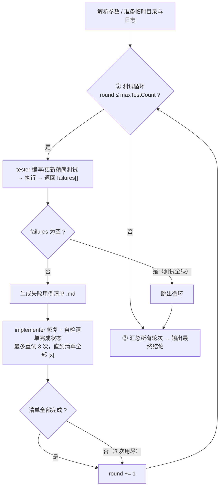

# iterative-runner / test-loop

一个"测试—修复"的迭代式测试运行器。针对**已存在的后端代码**，反复调用 Claude Code 的无头子进程（`claude -p`），让 **tester** 编写精简测试并执行、**implementer** 修复失败用例，循环直到测试全绿或达到上限，最后给出总结。

入口文件：[`test-loop.ts`](./test-loop.ts)

与 [`iterative.ts`](./iterative.ts)（实现—审查—修复）并行，骨架一致，区别是把"审查"换成"测试执行"，且**没有初始实现阶段**——被测代码假定已存在。

---

## 一、整体流程

`test-loop.ts` 的 `main()` 串起整个生命周期，分为三个阶段：



核心状态由 `State` 接口承载：

| 字段 | 含义 |
| --- | --- |
| `round` | 当前测试轮次，从 1 开始 |
| `projectDir` | 项目根目录（即 `cwd`） |
| `tmpDir` | 本次运行的临时目录，存放各轮失败用例清单 |
| `requirements` | 用户的测试需求（测什么、被测代码、语言） |
| `agentName` | 修复用 agent 名，默认 `implementer` |
| `maxTestCount` | 测试轮数上限，默认 `2` |

---

## 二、命令行用法

```bash
node --experimental-strip-types iterative-runner/test-loop.ts \
  [--agent <name>] \
  [--max-test-count N] \
  "<测试需求描述>"
```

参数由 [`lib/utils.ts`](./lib/utils.ts) 的 `parseCliArgs` 解析：

- `--agent <name>`：指定修复用 agent，默认 `implementer`。
- `--max-test-count N`：测试轮数上限，必须为 `>= 1` 的整数，默认 `2`。超出范围会报错退出。
- 其余非 flag 文本合并为 `requirements`（测试需求描述）。若为空则打印用法并 `exit(1)`。

需求描述里应包含：**测什么、被测代码位置、用什么语言**。语言与执行方式不在此硬编码，由 tester agent 根据需求与被测代码自行决定（python / node / …）。

> 注意：flag 解析用的是正则 `--key value` 形式，需求描述中若含 `--xxx yyy` 段落会被当作 flag 吞掉。

---

## 三、各阶段详解

### 阶段 ② 测试循环

`while (state.round <= state.maxTestCount)`，每轮做三件事：

**1) 测试 — `runTesterAgent`**

固定调用 `tester` agent，并通过 `--json-schema`（[`schemas/tester-schema.json`](./schemas/tester-schema.json)）强制其返回结构化 JSON 数组：

```json
[{ "case": "用例名", "failure": "失败原因（通过时留空）", "passed": false }]
```

tester 的职责：用 Read/Grep/Glob 定位被测代码 → 编写**精简测试**（不引用测试框架，直接 import 被测方法，断言用语言内置 `assert`，仅在确有必要时引入一个辅助组件）→ 用 Bash 自行执行测试 → 据 stdout/exit code 判定每个用例 PASS/FAIL。

- 返回非数组 → 抛错终止流程。
- runner 只取 `passed === false` 的项作为 `failures`；返回空数组（或全部通过）→ 打印 `tests passed`，`break` 跳出循环。

每轮 failures 会记录为 `test_failures` 日志。

**2) 生成失败用例清单 — `generateIssueFile`**

把 failures 写成 Markdown 清单文件 `<tmpDir>/<round>.md`，每项形如：

```markdown
- [ ] <case>
  - 失败：<failure>
```

先用 `callModel`（直接调 `/v1/messages`）让模型把 failures 整理成规范 Markdown；若模型输出不含 `- [ ]`，则回退到本地拼接的简单格式。

**3) 修复 + 完成自检（最多 3 次）**

内层 `for (attempt = 1..3)` 循环：

- `runImplementAgent(state, issueFile)`：把失败用例清单文件路径交给 implementer，让它"查看清单 → 修复（可改被测代码或测试代码）→ 把对应项的 `- [ ]` 改成 `- [x]`"。
- `checkIssueFileCompleted(issueFile)`：判断清单是否全部完成。
  - 先用 `callModel` + `json_schema` 让模型判定，返回 `{"completed": true/false}`；
  - 若 JSON 解析失败，回退为本地字符串判断：清单中不再包含 `- [ ]` 即视为完成。
- 一旦 `fixed === true` 立即 `break`，否则 3 次用尽后打印 `fix attempts exhausted`。

无论是否修复完成，`state.round += 1` 进入下一轮测试。

### 阶段 ③ 最终归纳 — `summarizeAllRounds`

读取 `tmpDir` 下所有 `.md` 文件（按文件名排序，即按轮次），拼接后用 `callModel` 让模型给出最终结论：总轮数、每轮失败用例、修复情况、是否遗留。结果直接打印到 stdout，并记录为 `final_summary` 日志。

若中途没有产生任何 `.md`（即首轮测试即全绿），返回"所有轮次测试均通过，流程结束"。

---

## 四、终止条件

流程在以下任一情况结束：

1. **测试通过**：某轮 tester 返回空数组，提前 `break`。
2. **达到上限**：`state.round > maxTestCount`，打印 `reached max test count`。
3. **出错**：任何阶段抛异常，打印错误并 `exit(1)`，错误信息（含 stack）写入 `error` 日志。

---

## 五、两种模型调用方式

与 `iterative.ts` 完全一致，对应不同模块：

| 方式 | 模块 | 用途 | 特点 |
| --- | --- | --- | --- |
| `runClaudeAgent` / `runClaudeTextAgent` | [`lib/claude-spawn.ts`](./lib/claude-spawn.ts) | 调用 **agent**（tester / implementer）执行测试编写执行与修复 | `spawn` 一个 `claude -p` 子进程，带 `--dangerously-skip-permissions`；`runClaudeAgent` 额外用 `--output-format json` + `--json-schema` 拿结构化输出 |
| `callModel` | [`lib/call-model.ts`](./lib/call-model.ts) | 轻量文本任务：整理失败清单、判定清单完成、最终归纳 | 直接 `fetch` 调用 `/v1/messages`，不经过 Claude Code 子进程 |

`callModel` 依赖三个环境变量（缺失即报错）：

- `ANTHROPIC_BASE_URL`
- `ANTHROPIC_AUTH_TOKEN`
- `ANTHROPIC_MODEL`

---

## 六、文件与日志产出

本次运行的所有产物落在项目根的 `.voyo-work/` 下：

```
.voyo-work/
├── tmp/
│   └── test-loop/
│       └── <yyyy-MM-dd>.<6位随机数>/   # tmpDir
│           ├── 1.md                     # 第 1 轮失败用例清单
│           ├── 2.md                     # 第 2 轮失败用例清单
│           └── ...
└── logs/
    └── <yyyy-MM-dd>/
        └── test-loop_<yyyyMMddHHmmss>.log   # JSONL 日志
```

日志由 [`lib/log-state.ts`](./lib/log-state.ts) 的 `createLogger(projectDir, 'test-loop')` 产出，每条记录一行 JSON，含 `timestamp` 字段。记录类型：

- `test_failures` — 某轮测试结果（含 failures）
- `implement_fix` — 某轮某次修复尝试（含 round、attempt）
- `final_summary` — 最终归纳
- `error` — 异常（含 message、stack）

---

## 七、关键设计要点

- **仅测试，不写被测代码**：流程一进来就进测试循环，没有"初始实现"阶段。第一轮 tester 从无到有编写测试文件，后续轮次在其基础上增补/修正再执行。
- **语言由 prompt 决定**：runner 不硬编码被测语言/执行器，tester agent 根据需求与被测代码自行选择（python / node / …）。
- **测试与修复职责分离**：tester 只写/改测试文件、执行测试、报告结果，**不改被测代码**；implementer 负责修复（可改被测代码或测试代码）。二者通过"失败用例清单文件"这一中间产物通信。
- **结构化约束只加在 tester 上**：tester 用 JSON Schema 强制输出 `{case, failure, passed}[]`，便于程序解析；implementer 不约束输出格式，避免干扰其自由编码。
- **修复完成用"清单勾选"判定**：以清单里 `- [ ]` 是否全部变为 `- [x]` 作为单轮修复完成的信号，并辅以模型判定 + 本地字符串回退两道保险。
- **双重终止保护**：单轮修复最多重试 3 次，整体测试最多 `maxTestCount` 轮，防止无限循环。
- **临时目录隔离**：每次运行用 `日期.6位随机` 生成独立 `tmpDir`，多轮清单互不覆盖，也便于事后排查。
